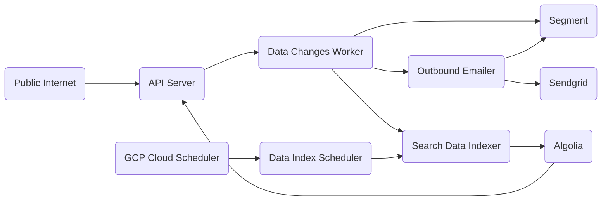

# Server Starter

## dev dependencies

The following tools are prerequisites for development work:

- [go](https://golang.org/) 1.21
- [docker](https://docs.docker.com/get-docker/) &&  [docker-compose](https://docs.docker.com/compose/install/)
- [wire](https://github.com/google/wire) for dependency management
- [make](https://www.gnu.org/software/make/) for task running
- [sqlc](https://sqlc.dev/) for generating database code
- [gci](https://www.github.com/daixiang0/gci) for sorting imports
- [tagalign](https://www.github.com/4meepo/tagalign) for aligning struct tags
- [terraform](https://learn.hashicorp.com/tutorials/terraform/install-cli) for deploying/formatting
- [cloud_sql_proxy](https://cloud.google.com/sql/docs/postgres/sql-proxy) for production database access
- [fieldalignment](https://pkg.go.dev/golang.org/x/tools/go/analysis/passes/fieldalignment) (`go install golang.org/x/tools/go/analysis/passes/fieldalignment/cmd/fieldalignment@latest`)

## dev setup

It's a good idea to run `make test lint integration_tests` before commits.

## running the server

1. clone this repository
2. run `make dev`
3. [http://localhost:8000/](http://localhost:8000/)

## features

### for users

This service, out of the box, supports:
- self-service user signup
- users can be associated with a group of users (called an account)
  - users can define a default account
  - users can sign up with an invitation token that will immediately associate them with a given account
- users have [RBAC](https://en.wikipedia.org/wiki/Role-based_access_control) permissions associated with their accounts and the base service
- users can enable two factor verification
  - users can rotate their two factor secret
- users can change their password, avatar, and details
- users can reset passwords if they forget them
- users can verify their email address
- account admins can change details about their account
- account admins can invite users to their accounts
- service admins can create settings
  - users can create configurations for these settings
- users can create webhooks for events related to their accounts
  - webhooks are executed asynchronously
- all data changes are published to an event queue
  - this can be hooked into to do things like send confirmation emails
- user notifications support
  - notifications can be arbitrarily created by admins, or created in the aforementioned async flow
- oauth2 client support
  - service admins can create oauth2 clients for users to authenticate with
- [Terraform](https://www.terraform.io/) code for deploying service to GCP

### external services supported

- Stripe support
  - abstracted such that you could support an alternative payment provider (I just haven't found a better one than Stripe)
- analytics support
  - support for [Segment](https://segment.com/), [Rudderstack](https://www.rudderstack.com/), and [Posthog](https://posthog.com/product-analytics)
- search support
  - support for [Algolia](https://www.algolia.com/) and [Elasticsearch](https://www.elastic.co/elasticsearch)
  - users are automatically indexed into a search engine provider of your choosing
  - trivial to add other data types to other indices
- managed email service support
  - support for [Mailgun](https://www.mailgun.com), [Mailjet](https://www.mailjet.com/), and [Sendgrid](https://sendgrid.com/en-us/solutions/email-api)
- feature flag support
  - support for [LaunchDarkly](https://launchdarkly.com/) and [Posthog](https://posthog.com/feature-flags)
- message queue support
  - support for [SQS](https://aws.amazon.com/sqs/), [Pub/Sub](https://cloud.google.com/pubsub/docs/overview), and [Redis](https://redis.io/)
- object storage support
  - support for [GCS](https://cloud.google.com/storage), [S3](https://aws.amazon.com/s3/), and local filesystem
- cache support
  - support for in-memory and [Redis](https://redis.io/)

### code features

- full unit tests for every package
- full service API client
- integration tests that spin up the full service against a proper database using the aforementioned API client
- generated [sqlc](https://sqlc.dev/) queries
- generated configuration files
- CI steps that validate generated files
- CI steps that test on every push to a PR

## infrastructure

